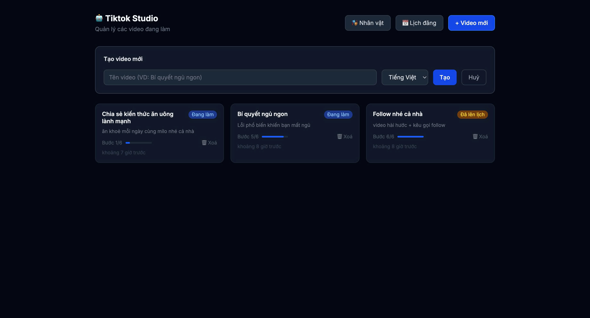
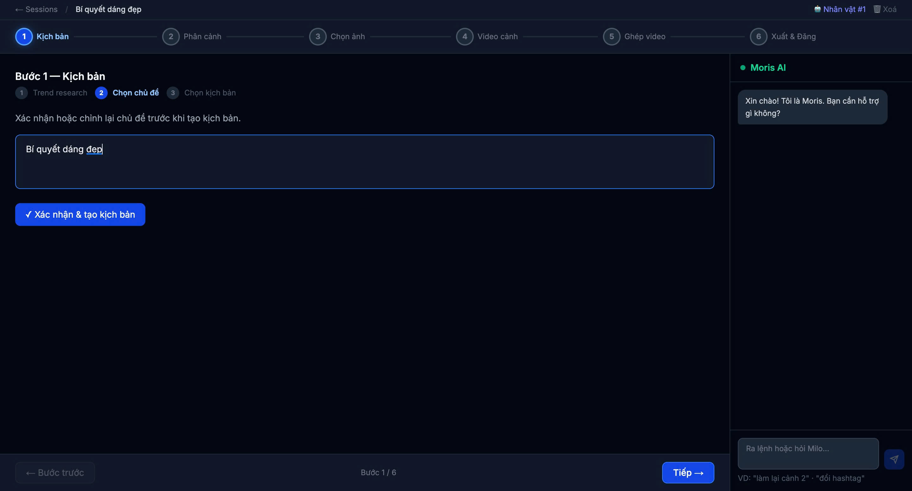
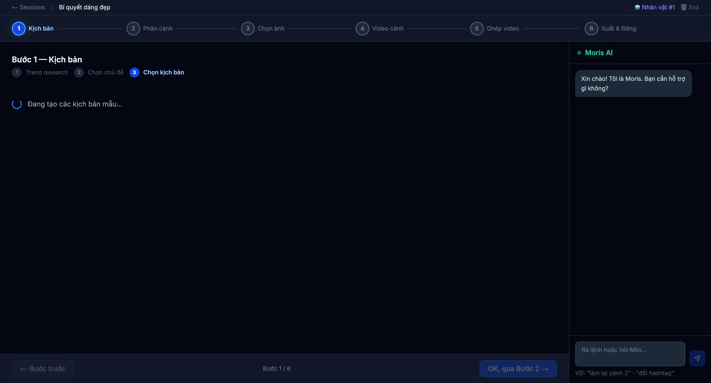
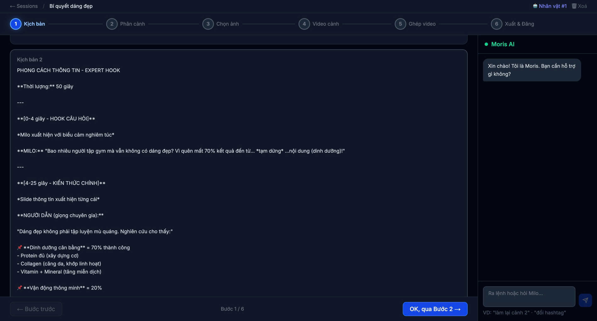
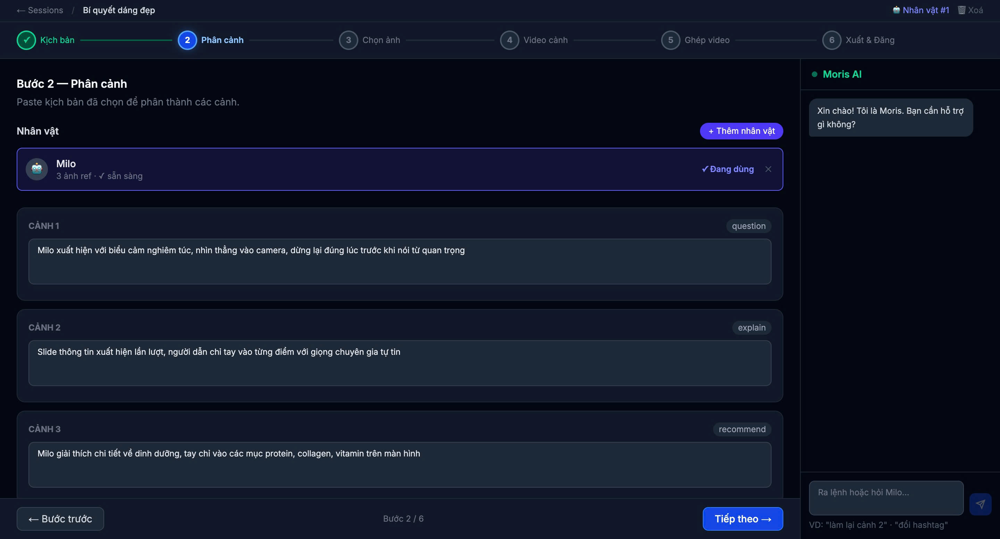
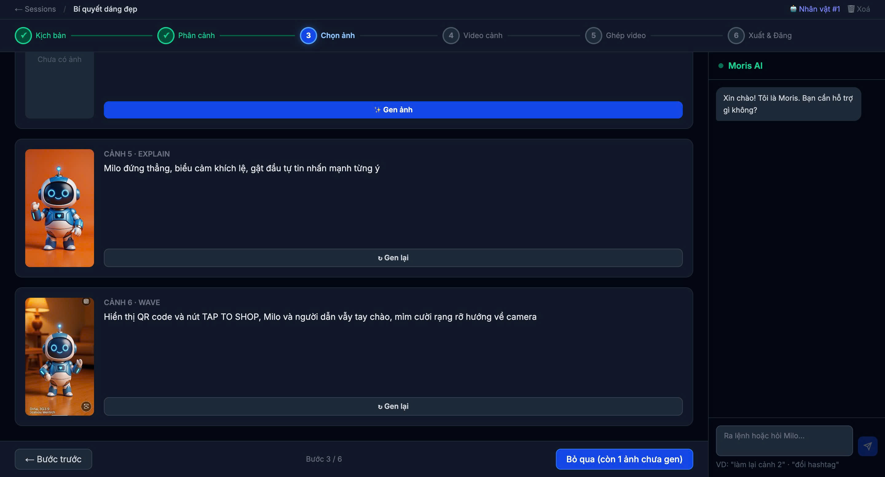
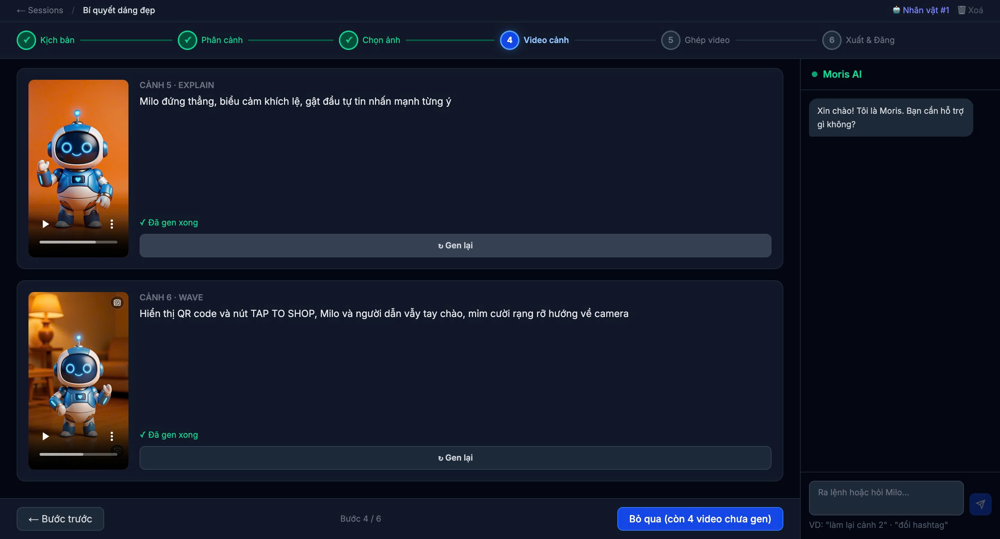
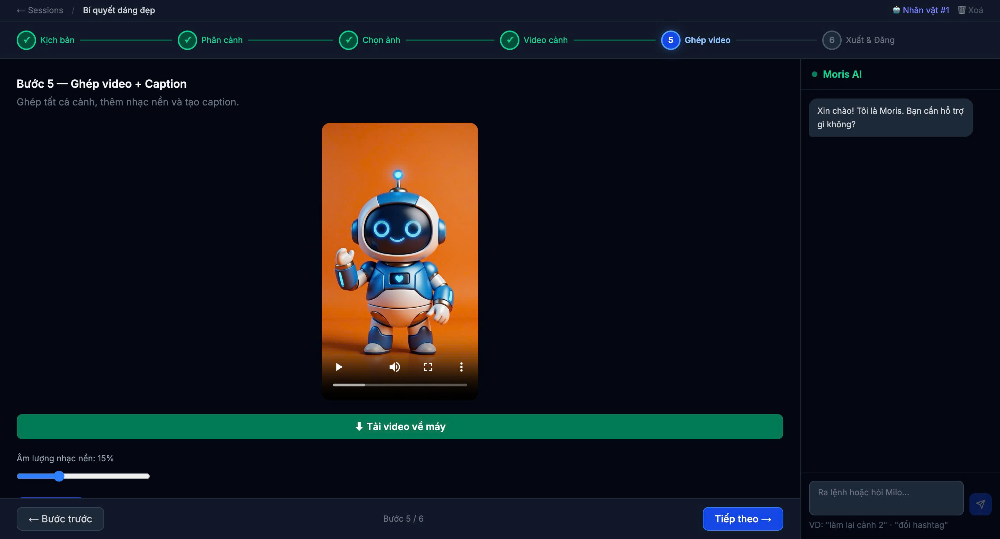
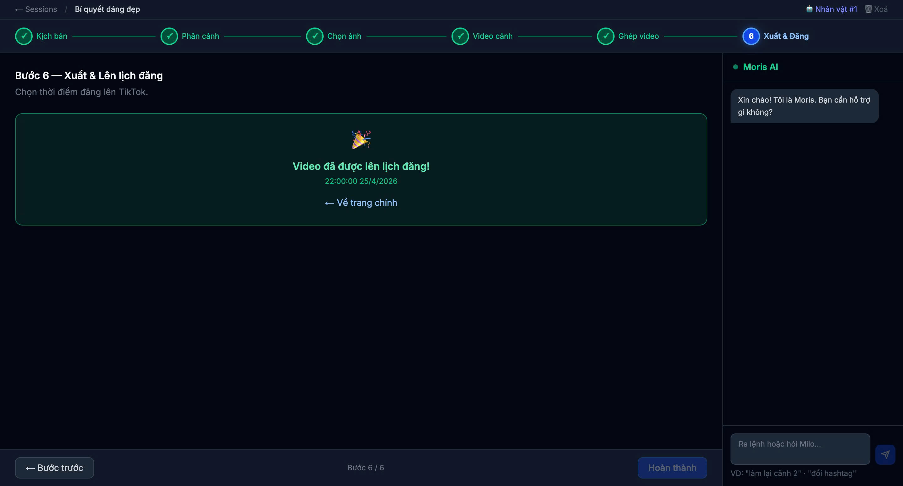

# Tiktok Studio

AI-powered TikTok video factory. Give it a topic, it handles everything: trend research, script writing, scene images, voiceover, video assembly, and scheduling.

Built for solo creators who want to ship content fast without touching a video editor.

---

## Demo

<p align="center">
  
  
  
</p>
<p align="center">
  
  
  
</p>
<p align="center">
  
  
  
</p>

---

## What it does

```
Topic → Trending script → Scene breakdown → AI images → TTS voiceover → Per-scene video → Final merged video → Caption + hashtags → Scheduled post
```

Each step is controlled through a browser UI. You can re-generate any scene image or video clip individually until it looks right, then merge the whole thing with one click.

---

## Stack

| Layer | Tech |
|-------|------|
| Frontend | Next.js 14 (App Router) |
| Backend | FastAPI + SQLAlchemy |
| Database | SQLite |
| Image gen | fal.ai FLUX Kontext Dev |
| Voice | edge-tts (Microsoft Edge Neural) |
| Video | ffmpeg |
| Script / Caption | Anthropic Claude API |
| Trend data | Reddit API (PRAW) |

---

## Prerequisites

- Python 3.11+
- Node.js 20+
- ffmpeg (`brew install ffmpeg` on Mac)
- API keys: `ANTHROPIC_API_KEY`, `FAL_KEY`, `REDDIT_CLIENT_ID`, `REDDIT_CLIENT_SECRET`

---

## Local setup

**1. Clone and install**

```bash
git clone https://github.com/nambz304/VideoTiktokWorkFlow.git
cd VideoTiktokWorkFlow

# Backend
cd backend
pip install -r requirements.txt
cd ..

# Frontend
cd frontend
npm install
cd ..
```

**2. Configure environment**

```bash
cp .env.example .env
# Edit .env and fill in your API keys
```

Required keys:
```
ANTHROPIC_API_KEY=sk-ant-...
FAL_KEY=...
REDDIT_CLIENT_ID=...
REDDIT_CLIENT_SECRET=...
REDDIT_USER_AGENT=TiktokStudio/1.0
```

**3. Run**

```bash
# Terminal 1
make backend

# Terminal 2
make frontend
```

Or both together (Ctrl+C to stop):

```bash
make dev
```

Open [http://localhost:3000](http://localhost:3000).

---

## Pipeline steps

| Step | What happens |
|------|-------------|
| 0 | Pick a character (AI persona with reference images) |
| 1 | Fetch trending topics from Reddit, generate a video script |
| 2 | Split script into scenes with emotion tags |
| 3 | Generate a 9:16 image for each scene via fal.ai (re-generate until it looks right) |
| 4 | Generate TTS audio + assemble each scene into a video clip |
| 5 | Merge all clips, add background music, generate caption and hashtags |
| 6 | Schedule or publish to TikTok |

---

## Scheduling

Step 6 lets you schedule a video for a specific date and time before publishing.

The scheduler page (`/schedule`) shows all upcoming and past scheduled posts in a calendar view. Scheduled videos stay in draft until their publish time, so you can queue up a week of content in one session.

---

## Characters

Characters live in `assets/characters/{id}/` as reference images. The AI uses them as a style anchor when generating scene images via FLUX Kontext.

To add a new character: create a folder under `assets/characters/` with PNG reference photos, then register it through the Characters page in the UI.

---

## Project structure

```
tiktokTeam/
├── backend/
│   ├── main.py                 # FastAPI app, static mounts, DB init
│   ├── models.py               # SQLAlchemy models (Session, Scene, Character)
│   ├── routers/                # API routes (pipeline, sessions, characters, chat, schedule)
│   └── services/
│       ├── kontext_generator.py  # fal.ai FLUX Kontext image gen
│       ├── tts_service.py        # edge-tts voiceover (3-attempt retry)
│       ├── video_assembler.py    # image + audio → scene.mp4 (ffmpeg)
│       └── video_merger.py       # merge clips + BGM → final.mp4
├── frontend/
│   ├── app/                    # Next.js App Router pages
│   │   ├── sessions/           # Session list
│   │   ├── studio/[sessionId]/ # Studio (main 6-step UI)
│   │   ├── characters/         # Character management
│   │   └── schedule/           # Publish scheduler
│   ├── components/
│   │   ├── steps/              # Step0–Step6 components
│   │   └── ChatSidebar.tsx     # AI chat assistant
│   └── lib/
│       ├── api.ts              # All backend API calls
│       └── types.ts            # Shared TypeScript types
├── assets/
│   ├── characters/             # Character reference images
│   └── bgm/                    # Background music tracks
├── output/                     # Generated images, clips, and final videos
├── Makefile                    # Dev commands
└── milo_studio.db              # SQLite database
```

---

## Notes

- fal.ai requires a funded account to generate images (Step 3). All other steps work without it.
- Videos are stored locally under `output/`. The backend serves them via `/output/` static route.
- SQLite database is at the repo root as `milo_studio.db`.
- CORS is currently locked to `localhost:3000` — update `ALLOWED_ORIGINS` in `.env` for production.

---

## License

MIT
